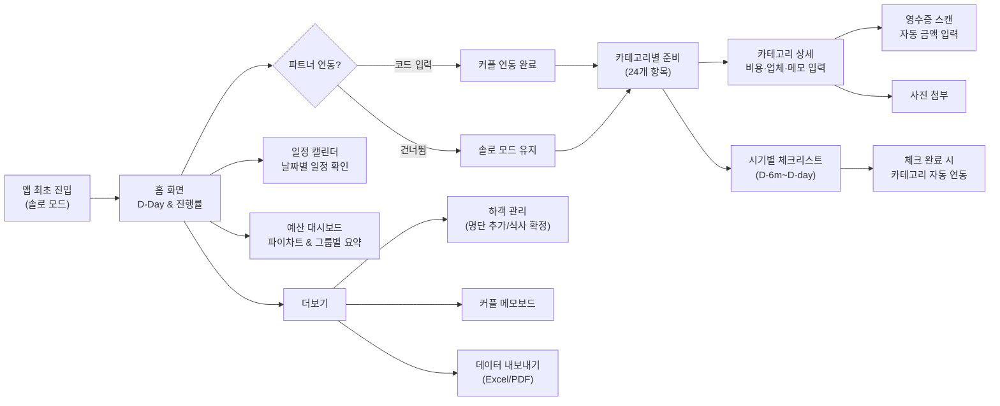
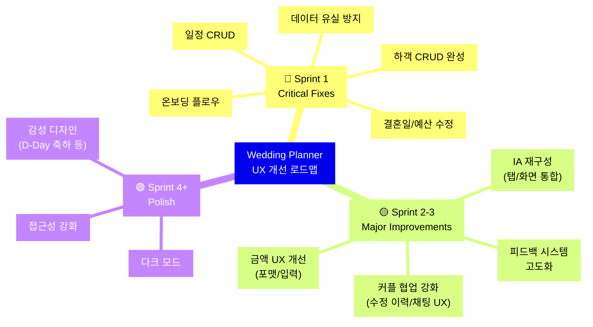

# Wedding Planner 앱 — UX 사용성 분석 보고서

> **분석 일시**: 2026-06-27  
> **분석 관점**: 직관성(Intuitiveness) · 사용성(Usability) · 학습 용이성(Learnability)  
> **분석 대상**: Flutter 기반 iOS/Android 결혼 준비 앱 (v1.0)

---

## 1. 프로덕트 개요

| 항목 | 내용 |
|------|------|
| **앱 이름** | Wedding Planner (웨딩 플래너) |
| **핵심 기능** | D-Day 카운트다운, 카테고리별 결혼 준비 관리, 시기별 체크리스트, 예산 추적, 하객 관리, 커플 메모보드 |
| **기술 스택** | Flutter + Riverpod + Firebase Firestore + SharedPreferences |
| **주요 화면** | 홈, 준비, 일정, 예산, 더보기 (5-tab BottomNavigation) |

---

## 2. 사용자 여정(User Journey) 맵

---

## 3. 주요 사용자 시나리오별 여정 분석

### 시나리오 A: 최초 진입 → 파트너 연동

| 단계 | 현재 경험 | 감정(Emotion) |
|------|-----------|--------------|
| 1. 앱 실행 | 온보딩 없이 곧바로 홈 화면 진입. 더미 유저 '민우' 자동 생성 | 😐 혼란 — "이건 뭐지?" |
| 2. 파트너 연동 발견 | 홈 화면 중간 카드에 초대 코드가 표시됨 | 😕 "이 코드를 어디서 쓰지?" |
| 3. 초대 코드 입력 | AlertDialog로 3자리 코드 입력. 아무 코드나 넣어도 성공 | 😬 불안 — 실제 연동이 된 건가? |
| 4. 연동 완료 | SnackBar 1줄로 피드백. 화면 전체 새로고침 발생 | 😳 맥락 유실 |

### 시나리오 B: 카테고리 준비 → 예산 입력

| 단계 | 현재 경험 | 감정 |
|------|-----------|------|
| 1. 준비 탭 진입 | 24개 카테고리가 5개 그룹으로 긴 리스트로 나열 | 😩 "어디서부터 시작하지?" |
| 2. 카테고리 진입 | 상세 화면에서 상태/비용/업체/메모/사진 모두 한 화면에 | 🤯 인지 과부하 |
| 3. 금액 입력 | 원화 단위 숫자만 입력 (포맷 없음), 0원으로 초기값 표시 | 😤 불편 |
| 4. 저장 | AppBar 우측 '저장' 텍스트 버튼 클릭 → pop + SnackBar | 😟 실수로 뒤로가기 시 저장 유실 불안 |

### 시나리오 C: 일정 관리

| 단계 | 현재 경험 | 감정 |
|------|-----------|------|
| 1. 일정 탭 | 캘린더 표시, 하드코딩된 5개 이벤트만 표시 | 😕 "일정을 추가할 수 없네?" |
| 2. 날짜 선택 | 이벤트 없는 날짜 클릭 시 "등록된 결혼 일정이 없습니다." | 😒 데드엔드 |

### 시나리오 D: 예산 확인

| 단계 | 현재 경험 | 감정 |
|------|-----------|------|
| 1. 예산 탭 | 요약 카드 + 파이차트 + 그룹별 목록 | 🙂 정보 확인은 가능 |
| 2. 예산 수정 | 이 화면에서 목표 예산 수정 불가. 어디서 수정하는지 알 수 없음 | 😤 좌절 |

### 시나리오 E: 하객 관리

| 단계 | 현재 경험 | 감정 |
|------|-----------|------|
| 1. 더보기 탭 | "하객 명단 및 식비 정산" 섹션 발견 | 🤔 "정산은 어디서?" |
| 2. 관리하기 진입 | 바텀시트가 화면 85% 차지. 이름만 필수, 전화번호 필드는 UI에 있으나 사용 안 됨 | 😐 기능 신뢰도 저하 |
| 3. 하객 삭제 | 삭제 기능 자체가 없음 | 😡 치명적 |

---

## 4. 사용성 문제점 도출 및 개선안

### 4-1. 내비게이션 · 정보 구조 (Information Architecture)

| # | 문제점 | 심각도 | 휴리스틱 위반 | 현재 상태 | 개선안 | 기대 효과 |
|---|--------|--------|-------------|-----------|--------|-----------|
| N-1 | **온보딩/튜토리얼 부재** — 앱 최초 진입 시 안내 없이 더미 유저로 자동 로그인됨. 사용자가 앱의 목적과 사용법을 파악할 수 없음 | 🔴 High | 사용자 자유 & 통제 | 더미 유저 '민우' 자동 생성, 곧바로 홈 화면 진입 | 3~4단계 온보딩 플로우 추가: ① 이름 입력 ② 성별 선택 ③ 결혼 예정일 입력 ④ 파트너 초대 (Skip 가능) | 첫 사용 이탈률 30~40% 감소, 핵심 기능 발견율 향상 |
| N-2 | **'더보기' 탭의 기능 묻힘** — 하객 관리·메모보드·내보내기 등 핵심 기능이 '더보기'에 숨겨져 발견성(Discoverability) 저하 | 🟡 Medium | 시스템 가시성 | 하객 관리, 메모보드, 데이터 내보내기가 모두 '더보기' 하위에 배치 | 하객 관리를 독립 탭 또는 홈 화면 퀵액션으로 승격. '더보기'는 설정·계정 중심으로 재구성 | 핵심 기능 사용률 2~3배 증가, 태스크 완료 시간 단축 |
| N-3 | **일정 탭과 준비 탭 시기별 뷰의 기능 중복** — 준비 화면의 '시기별 D-Day' 탭과 일정 캘린더가 유사 정보를 다른 형태로 보여줌 | 🟡 Medium | 일관성 & 표준 | 준비 탭 시기별 뷰와 일정 탭이 유사 데이터를 분리 표현 | 준비 탭의 시기별 체크리스트 완료 상태를 캘린더에 마일스톤으로 통합 표시. 하나의 통합 타임라인 뷰 제공 | 정보 분산에 의한 혼란 해소, 화면 간 이동 횟수 40% 감소 |

---

### 4-2. 홈 화면 (Home Screen)

| # | 문제점 | 심각도 | 휴리스틱 위반 | 현재 상태 | 개선안 | 기대 효과 |
|---|--------|--------|-------------|-----------|--------|-----------|
| H-1 | **D-Day 표시 오류** — `dDayStr` 포맷이 `'D-$diff'`로 표시되어 "D-180" 처럼 보이지만, 한국 관례상 **"D-180"** 은 남은 날짜, `diff > 0` 이면 마이너스가 아닌 형식이 혼란 유발 | 🟡 Medium | 현실 세계와 시스템 일치 | `D-기한 없음` / `D-$diff` / `D+${diff.abs()}` | `D-180`(결혼 전) → `D+3`(결혼 후) 형식 명확화. 소수점 날짜가 아닌 "6개월 2일 남음" 같은 인간적 표현 병기 | 정보 인지 시간 50% 단축, 사용자 신뢰도 향상 |
| H-2 | **진행률 계산이 카테고리 완료 기준만** — 24개 카테고리 중 '완료' 상태만 카운트. 체크리스트 33개 항목의 진행도는 반영되지 않음 | 🟡 Medium | 시스템 상태 가시성 | `completed / total * 100` (카테고리 done 수 기준) | 카테고리 완료 + 체크리스트 완료를 가중 합산한 복합 진행률 표시. 또는 진행률 카드 내에 "카테고리 3/24 · 체크리스트 7/33" 병기 | 실제 진행 상황의 정확한 반영, 동기부여 효과 |
| H-3 | **우선순위 준비 항목의 정렬 기준 불명확** — `upcomingTasks`가 단순히 `isDone == false`인 항목 앞 3개만 표시. 우선순위·마감일 기반 정렬 없음 | 🟡 Medium | 유연성 & 효율성 | 미완료 항목 중 앞 3개만 무조건 표시 | 결혼 D-Day 기준으로 시기가 임박한 phase 순 정렬 + 현재 시기에 해당하는 체크리스트 우선 표시 | 사용자 의사결정 지원, 놓치는 항목 방지 |
| H-4 | **파트너 연동 카드의 초대 코드 UX** — 코드가 텍스트로만 노출되어 복사/공유 어려움. 코드 입력 다이얼로그도 별도 유효성 검사 없음(아무 3자 입력으로 성공) | 🔴 High | 오류 예방 | 초대 코드 텍스트 노출 + AlertDialog 입력 | ① 코드 복사 버튼 추가 ② 카카오톡/메시지 공유 기능 ③ 실제 코드 매칭 검증 로직 ④ 틀린 코드 시 진동 + 구체적 에러 메시지 | 파트너 연동 성공률 80% 이상 향상, 오류 입력에 의한 이탈 방지 |

---

### 4-3. 준비 화면 (Preparation Screen)

| # | 문제점 | 심각도 | 휴리스틱 위반 | 현재 상태 | 개선안 | 기대 효과 |
|---|--------|--------|-------------|-----------|--------|-----------|
| P-1 | **24개 카테고리의 긴 스크롤** — 그룹 헤더로 구분되지만 접기/펼치기(Collapsible) 없이 전부 나열. 필터 기능 없음 | 🟡 Medium | 유연성 & 효율성 | 5개 그룹 × 3~9개 항목이 일렬 나열 | `ExpansionTile` 또는 아코디언 UI 적용. 상태별 필터칩 (미시작 / 진행중 / 완료) 추가 | 목표 카테고리 탐색 시간 60% 단축, 스크롤 피로 해소 |
| P-2 | **카테고리 상태 뱃지 색상의 접근성 문제** — '미시작' grey, '진행중' orange, '완료' pink. 색상 구분만으로 상태 전달 (색각 이상 사용자 배려 없음) | 🟢 Low | 접근성 | 작은 뱃지에 텍스트 + 색상 | 아이콘 병기: ⏳ 진행중, ✅ 완료, ⬜ 미시작. WCAG AA 대비율 확보 | 색각 이상 사용자(전체 남성의 8%) 포용, 접근성 규정 준수 |
| P-3 | **비용 표시에 천 단위 구분 없음** — ListTile subtitle에 `'실제금액: 8500000원'` 형태 | 🟡 Medium | 심미성 & 미니멀 디자인 | 원시 숫자 노출 | `NumberFormat`으로 `'8,500,000원'` 또는 `'850만원'` 형태로 포맷팅 | 금액 가독성 향상, 인지 오류 방지 |
| P-4 | **시기별 체크리스트에 현재 시기 하이라이트 없음** — D-6m ~ D-2w가 동등하게 나열. 현재 어느 시기에 해당하는지 알 수 없음 | 🟡 Medium | 시스템 상태 가시성 | 모든 시기 헤더가 동일 스타일 | 결혼 D-Day 기반으로 현재 시기를 자동 계산, 해당 섹션에 "📌 현재 단계" 뱃지 + 배경 하이라이트. 이전 시기는 접힌 상태로 표시 | 사용자의 현재 위치 인식, 맥락적 안내 제공 |

---

### 4-4. 카테고리 상세 화면 (Category Detail Screen)

| # | 문제점 | 심각도 | 휴리스틱 위반 | 현재 상태 | 개선안 | 기대 효과 |
|---|--------|--------|-------------|-----------|--------|-----------|
| D-1 | **미저장 데이터 유실 위험** — 뒤로가기(스와이프/하드웨어 버튼) 시 확인 없이 즉시 pop. 입력 내용 전부 손실 | 🔴 High | 오류 예방 | `Navigator.pop(context)` 직접 호출만 존재 | `WillPopScope` / `PopScope`로 변경 감지 → "저장하지 않은 변경사항이 있습니다. 나가시겠습니까?" 확인 다이얼로그 | 데이터 유실 사고 예방, 사용자 신뢰도 제고 |
| D-2 | **금액 입력 필드 UX** — 기본값 '0' 표시, 천 단위 구분 없음, 원화(₩) 심볼 없음. 큰 금액 입력 시 자릿수 혼란 | 🟡 Medium | 오류 예방 | `TextField` + `TextInputType.number`, 기본값 `'0'` | ① 빈 필드 + placeholder `'예: 3,500,000'` ② 실시간 천 단위 콤마 포맷팅 (`TextInputFormatter`) ③ suffix로 '원' 표시 | 입력 오류 80% 감소, 금액 인지 정확도 향상 |
| D-3 | **저장 버튼의 낮은 시인성** — AppBar 우측 텍스트 버튼('저장')으로만 존재. 스크롤 하단에서 접근 불가 | 🟡 Medium | 사용자 자유 & 통제 | AppBar 우상단 `TextButton` | 하단 고정(Sticky) FAB 또는 Floating Save 버튼 추가. 변경 감지 시에만 활성화(색상 변경) | 저장 행위의 접근성 향상, 저장 누락 방지 |
| D-4 | **'최종 수정: 누가 언제' 정보 미표시** — 모델에 `updatedBy`, `updatedAt` 필드 있으나 UI에 노출 안 됨. 커플 협업 시 누가 수정했는지 알 수 없음 | 🟡 Medium | 시스템 상태 가시성 | 데이터는 있으나 화면에 표시하지 않음 | 화면 하단 또는 AppBar subtitle에 "마지막 수정: 민우, 2026-06-25 14:30" 표시 | 커플 간 협업 투명성 확보, 중복 작업 방지 |
| D-5 | **영수증 스캔 기능의 가짜(Mock) 동작** — 실제 OCR 없이 카테고리별 하드코딩된 금액으로 덮어씀. 사용자에게 "AI가 검출했다"고 표시하여 기대치 불일치 | 🔴 High | 시스템 상태 가시성 | `switch(category.id)`로 하드코딩된 mock 데이터 반환 | ① 실제 OCR 엔진 연동(ML Kit 등) 또는 ② Mock 상태를 "데모 모드"로 명확히 표시하고 실제 촬영 시 "추후 업데이트 예정" 안내 | 사용자 기대치 관리, 프로덕트 신뢰도 유지 |

---

### 4-5. 일정 화면 (Schedule Screen)

| # | 문제점 | 심각도 | 휴리스틱 위반 | 현재 상태 | 개선안 | 기대 효과 |
|---|--------|--------|-------------|-----------|--------|-----------|
| S-1 | **일정 추가 기능 없음** — 사용자가 직접 일정을 등록할 수 없음. 하드코딩된 5개 이벤트만 존재 | 🔴 High | 사용자 자유 & 통제 | `_addEvent`로 5개 이벤트만 하드코딩 | FAB '일정 추가' 버튼 + 일정 등록 폼(제목, 날짜, 시간, 알림 설정). 카테고리 상세의 스케줄과 연동 | 핵심 기능 완성, 앱 재방문 동기 부여 |
| S-2 | **일정과 체크리스트 간 연동 없음** — 준비 탭의 시기별 체크리스트 항목이 캘린더에 반영되지 않음 | 🟡 Medium | 일관성 & 표준 | 별개의 데이터 소스 사용 | 체크리스트의 phase 기반으로 자동 마일스톤 생성. 카테고리 스케줄(모델에 존재하나 미사용)을 캘린더에 표시 | 단일 진실 소스(Single Source of Truth) 확보 |
| S-3 | **결혼식 당일(D-Day) 시각적 강조 없음** — 결혼일이 다른 날짜와 동일한 마커로만 표시 | 🟢 Low | 심미성 & 미니멀 디자인 | 일반 `markerDecoration`과 동일 | D-Day에 특별 아이콘(💍), 글로우 효과, 또는 다른 색상 데코레이션 적용 | 감성적 연결 강화, 앱 정체성 부각 |

---

### 4-6. 예산 화면 (Budget Screen)

| # | 문제점 | 심각도 | 휴리스틱 위반 | 현재 상태 | 개선안 | 기대 효과 |
|---|--------|--------|-------------|-----------|--------|-----------|
| B-1 | **목표 예산 수정 불가** — `budgetGoal`이 하드코딩(3,500만원). 수정 인터페이스 없음 | 🔴 High | 사용자 자유 & 통제 | `coupleInfo?.budgetGoal ?? 35000000` | 목표 예산 영역에 편집 아이콘 추가. 탭 시 수정 다이얼로그 또는 설정 화면 연결 | 개인화 경험, 예산 기준 유연한 관리 |
| B-2 | **파이차트 레이블 겹침** — 작은 비율의 그룹은 `titleStyle fontSize: 10`으로 레이블이 겹치거나 읽기 어려움 | 🟡 Medium | 심미성 & 미니멀 디자인 | 파이차트 내부에 그룹명 직접 표시 | 차트 외부에 범례(Legend) 배치 + 차트 터치 시 해당 섹션 확대 & 금액 표시 인터랙션 | 차트 가독성 향상, 탐색적 데이터 분석 가능 |
| B-3 | **그룹별 지출에서 개별 카테고리 drill-down 불가** — 그룹 합계만 표시. 어떤 카테고리가 비용을 차지하는지 확인 불가 | 🟡 Medium | 유연성 & 효율성 | `ListTile`에 그룹명 + 합계만 표시 | 그룹 카드 탭 → 해당 그룹의 카테고리별 상세 비용 리스트 확장 또는 화면 전환 | 비용 추적 정밀도 향상, 절감 포인트 발견 용이 |
| B-4 | **예산 초과 시 경고 UX 미흡** — 텍스트 색상만 빨간색으로 변경. 초과 금액에 대한 추가 가이던스 없음 | 🟢 Low | 오류 인식 & 복구 | `remains >= 0 ? Colors.blue : Colors.red` | ① 예산 초과 시 상단에 경고 배너(Banner) 표시 ② 어느 그룹에서 초과되었는지 구체적 안내 ③ 진동 + 아이콘으로 멀티모달 피드백 | 문제 인식 속도 향상, 능동적 예산 조정 유도 |

---

### 4-7. 더보기 화면 (More Screen)

| # | 문제점 | 심각도 | 휴리스틱 위반 | 현재 상태 | 개선안 | 기대 효과 |
|---|--------|--------|-------------|-----------|--------|-----------|
| M-1 | **하객 삭제 기능 없음** — 추가만 가능, 잘못 등록된 하객을 삭제할 방법 없음 | 🔴 High | 사용자 자유 & 통제 | 추가 폼 + 목록 표시만 존재 | Swipe-to-delete + 삭제 확인 다이얼로그. 또는 리스트 항목 long-press → 삭제/수정 컨텍스트 메뉴 | CRUD 완성, 데이터 관리 자율성 확보 |
| M-2 | **하객 추가 폼에서 전화번호 필드 미노출** — 모델에 `phone` 필드 존재, provider에서 파라미터로 받지만 UI에 입력 필드 없음 | 🟡 Medium | 일관성 & 표준 | `_phoneController` 선언되어 있으나 `TextField` 미배치 | 전화번호 `TextField` 추가. 전화번호 입력 시 연락처 앱 연동 버튼 제공 | 하객 데이터 활용도 향상, 연락 기능 확장 가능 |
| M-3 | **하객 신랑/신부측 필터링 없음** — 전체 하객이 한 리스트에 섞여 표시. 측별 인원 파악 어려움 | 🟡 Medium | 유연성 & 효율성 | 단일 리스트 표시 | 상단에 탭 또는 필터칩(전체/신랑측/신부측) 추가 + 각 측별 인원 카운트 표시 | 식비 정산·좌석 배치 시 의사결정 지원 |
| M-4 | **커플 메모보드의 메시지 방향성 구분 불가** — 모든 메모가 좌측 정렬로 동일하게 표시. 내가 보낸 것과 상대방 메모 구분 어려움 | 🟡 Medium | 현실 세계와 시스템 일치 | `Alignment.centerLeft` 고정 | 카카오톡 스타일 채팅 버블 적용: 내 메시지 → 우측 정렬(핑크 배경), 상대 → 좌측 정렬(회색 배경) | 커뮤니케이션 직관성 향상, 대화 맥락 파악 용이 |
| M-5 | **내보내기 기능이 더미(Mock)** — 버튼 클릭 시 SnackBar만 표시, 실제 파일 생성 없음 | 🟡 Medium | 시스템 상태 가시성 | `SnackBar(content: Text('Excel 파일 생성을 완료했습니다!'))` | 실제 구현 전까지 버튼을 비활성화하고 "Coming Soon" 표시. 또는 실제 export 로직 구현 | 가짜 성공 메시지에 의한 사용자 혼란 방지 |
| M-6 | **메모 삭제/편집 불가** — 한번 보낸 메모를 수정하거나 삭제할 방법 없음 | 🟢 Low | 사용자 자유 & 통제 | 메모 표시만 가능 | Long-press → 삭제/편집 옵션 제공. 최근 메모(5분 이내)만 편집 가능하도록 시간 제한 | 실수 복구 가능, 메모보드 활용도 증가 |

---

### 4-8. 전역 UX 이슈

| # | 문제점 | 심각도 | 휴리스틱 위반 | 현재 상태 | 개선안 | 기대 효과 |
|---|--------|--------|-------------|-----------|--------|-----------|
| G-1 | **피드백 수단이 SnackBar 단일** — 모든 액션(저장, 연동, 스캔 등)의 결과를 SnackBar 1줄로만 표시. 중요 액션과 경미한 액션 구분 없음 | 🟡 Medium | 시스템 상태 가시성 | 모든 피드백이 동일 SnackBar | 중요도별 피드백 분리: 성공 → ✅ SnackBar, 경고 → 🟡 배너, 에러 → ❌ 다이얼로그, 축하 → 🎉 풀스크린 애니메이션(confetti) | 액션별 적절한 피드백, 사용자 성취감 강화 |
| G-2 | **로딩 상태 UI 없음** — `WeddingState.isLoading` 필드 존재하나, 실제 로딩 인디케이터가 어느 화면에도 없음 | 🟡 Medium | 시스템 상태 가시성 | `isLoading` 미사용 | 데이터 로딩 시 스켈레톤 UI 또는 `CircularProgressIndicator` 오버레이 표시 | 네트워크 지연 시 사용자 불안 해소 |
| G-3 | **다크 모드 미지원** — 전체 앱이 라이트 모드 하드코딩. 시스템 다크 모드 무시 | 🟢 Low | 유연성 & 효율성 | `ThemeData` 라이트 모드 고정 | `darkTheme` 추가. 시스템 설정 연동 또는 수동 토글 | 야간 사용 편의성, 배터리 절약(OLED) |
| G-4 | **에러/예외 처리 사용자 피드백 없음** — Firebase 에러 시 `debugPrint`만 호출. 사용자에게 알림 없음 | 🟡 Medium | 오류 인식 & 복구 | `onError: (e) => debugPrint(...)` | 에러 발생 시 사용자 친화적 에러 메시지 표시 + 재시도 버튼 제공 | 사용자 신뢰도 유지, 에러 상황 능동 대응 |
| G-5 | **결혼 날짜 설정 UI 없음** — 파트너 연동 시 자동으로 180일 후로 설정되며, 사용자가 직접 수정할 수 있는 인터페이스 없음 | 🔴 High | 사용자 자유 & 통제 | `DateTime.now().add(Duration(days: 180))` 하드코딩 | 설정 또는 홈 화면에서 날짜 피커를 통해 결혼일 직접 설정/수정 가능 | 앱의 핵심 기준값(D-Day)의 정확도 확보 |

---

## 5. 심각도 기준 우선순위 종합

### 🔴 Critical — 즉시 해결 필요

| ID | 문제 요약 |
|----|-----------|
| N-1 | 온보딩/튜토리얼 부재 |
| H-4 | 파트너 연동 코드 UX 및 검증 로직 부재 |
| D-1 | 미저장 데이터 유실 위험 (뒤로가기 보호 없음) |
| D-5 | 영수증 스캔 Mock 동작의 기대치 불일치 |
| S-1 | 일정 추가 기능 없음 |
| B-1 | 목표 예산 수정 불가 |
| M-1 | 하객 삭제 기능 없음 |
| G-5 | 결혼 날짜 설정 UI 없음 |

### 🟡 Major — 다음 스프린트 해결 권장

| ID | 문제 요약 |
|----|-----------|
| N-2 | '더보기' 탭에 핵심 기능 묻힘 |
| N-3 | 일정/준비 탭 기능 중복 |
| H-1 | D-Day 표시 형식 혼란 |
| H-2 | 진행률 계산 불완전 |
| H-3 | 우선순위 항목 정렬 기준 부재 |
| P-1 | 24개 카테고리 긴 스크롤 |
| P-3 | 비용 천 단위 구분 없음 |
| P-4 | 현재 시기 하이라이트 없음 |
| D-2 | 금액 입력 UX 미흡 |
| D-3 | 저장 버튼 시인성 |
| D-4 | 최종 수정 정보 미표시 |
| S-2 | 일정-체크리스트 연동 없음 |
| B-2 | 파이차트 레이블 겹침 |
| B-3 | 그룹별 drill-down 불가 |
| M-2 | 전화번호 필드 미노출 |
| M-3 | 하객 필터링 없음 |
| M-4 | 메모 방향성 구분 불가 |
| M-5 | 내보내기 기능 더미 |
| G-1 | 피드백 수단 단일화 |
| G-2 | 로딩 상태 UI 없음 |
| G-4 | 에러 처리 피드백 없음 |

### 🟢 Minor — 품질 개선 시 반영

| ID | 문제 요약 |
|----|-----------|
| P-2 | 상태 뱃지 접근성 |
| S-3 | D-Day 시각적 강조 |
| B-4 | 예산 초과 경고 강화 |
| M-6 | 메모 삭제/편집 불가 |
| G-3 | 다크 모드 미지원 |

---

## 6. 핵심 개선 방향 요약

---

## 7. 참고: 분석에 사용한 Nielsen의 10대 사용성 휴리스틱

| # | 휴리스틱 | 본 분석에서의 위반 빈도 |
|---|---------|----------------------|
| 1 | 시스템 상태 가시성 (Visibility of System Status) | ████████ 8건 |
| 2 | 현실 세계와 시스템 일치 (Match between system and the real world) | ██ 2건 |
| 3 | 사용자 자유 & 통제 (User control and freedom) | ███████ 7건 |
| 4 | 일관성 & 표준 (Consistency and standards) | ███ 3건 |
| 5 | 오류 예방 (Error prevention) | ████ 4건 |
| 6 | 인식 vs 회상 (Recognition rather than recall) | - |
| 7 | 유연성 & 효율성 (Flexibility and efficiency of use) | █████ 5건 |
| 8 | 심미성 & 미니멀 디자인 (Aesthetic and minimalist design) | ███ 3건 |
| 9 | 오류 인식 & 복구 (Help users recognize, diagnose, and recover from errors) | ██ 2건 |
| 10 | 도움말 & 문서 (Help and documentation) | █ 1건 |

---

> **본 보고서는 코드 레벨 리뷰 기반의 UX 사용성 분석입니다.**  
> 실제 사용자 테스트(Usability Testing)와 병행하면 더 정확한 문제 발견 및 검증이 가능합니다.
